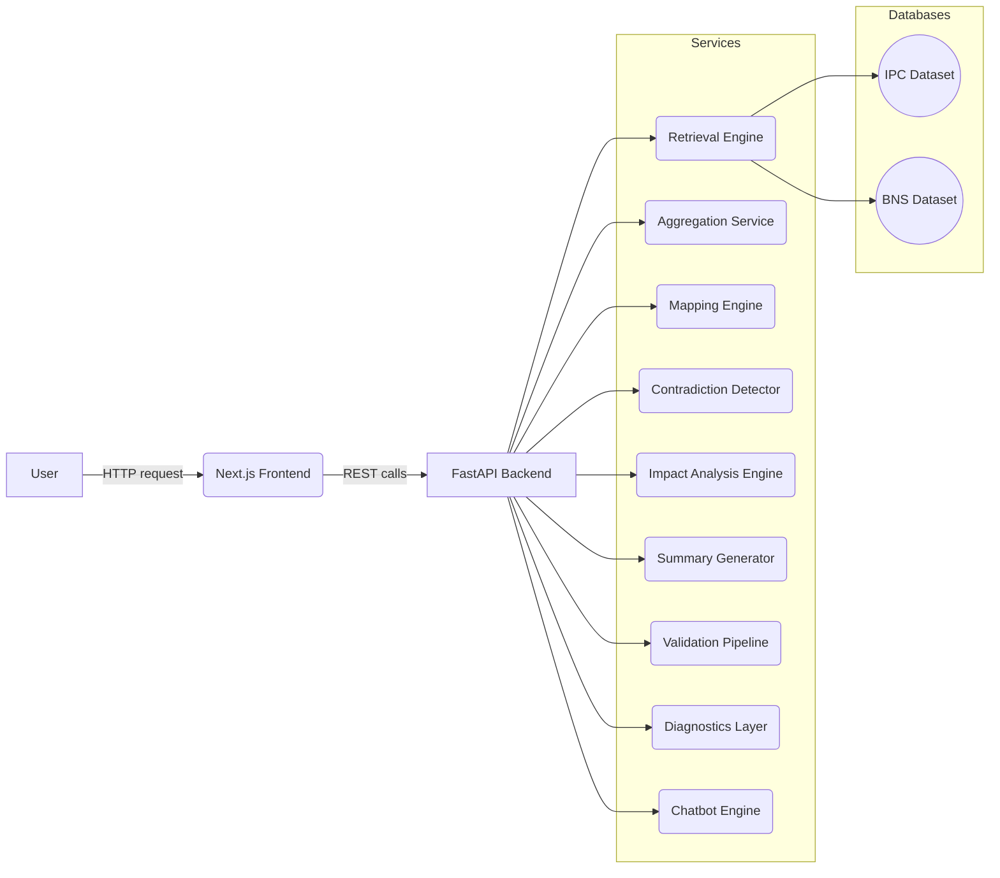

# 📘 NyayaSetu AI Engineering Handbook v1.0

> **Document Type:** Software Engineering Design Document (SEDD)  
> **Project:** NyayaSetu AI — Intelligent IPC ↔ BNS Legal Intelligence System  
> **Version:** 1.0 | **Date:** 2026-06-30  
> **Author:** Renuka  
> **Status:** Living Document — update on every major feature or architectural change

---

## Table of Contents

1. [Vision & Philosophy](#part-i--vision--philosophy)
2. [Requirements](#part-ii--requirements)
3. [System Architecture](#part-iii--system-architecture)
4. [Backend Services](#part-iv--backend-services)
5. [API & Data Model](#part-v--api--data-model)
6. [Folder & Code Organization](#part-vi--folder--code-organization)
7. [QA & Testing Strategy](#part-vii--qa--testing-strategy)
8. [CI/CD & Deployment](#part-viii-cicd--deployment)
9. [Engineering Standards](#part-ix--engineering-standards)
10. [Current Status & Roadmap](#part-x--current-status--roadmap)
11. [Glossary & References](#glossary--references)

---

## Part I – Vision & Philosophy

### 1.1 Why NyayaSetu AI?

India's criminal law underwent a landmark transformation in 2023 when the Bharatiya Nyaya Sanhita (BNS) replaced the 163-year-old Indian Penal Code (IPC). While the intent was modernization, practitioners, students, and researchers face enormous friction: sections were renumbered, merged, split, and reworded. NyayaSetu ("justice bridge") AI exists to eliminate that friction.

**The core problem:** Given an IPC section number or legal keyword, there is no fast, reliable, deterministic tool to:
- Find the equivalent BNS section
- Understand what changed (wording, penalty, scope)
- Detect contradictions between the two codes
- Understand downstream impact on related sections

NyayaSetu AI solves all four.

### 1.2 Mission & Objectives

| Objective | Description |
|-----------|-------------|
| Deterministic search | Same query always returns same ranked results — no randomness |
| IPC↔BNS mapping | Accurate, explainable section-level cross-referencing |
| Contradiction detection | Surface genuine conflicts between old and new code |
| Impact analysis | Show which sections are affected when one section changes |
| Explainability | Every output comes with human-readable reasoning |
| Testability | Every module has a contract, and every contract has tests |

### 1.3 Learning Philosophy

NyayaSetu is simultaneously a **production project** and a **learning laboratory**. Every QA/SDET capability learned must be:

1. Implemented in NyayaSetu (not just a toy example)
2. Covered by tests (unit, integration, or E2E)
3. Documented in the Logbook
4. Mapped to a resume bullet and interview Q&A

### 1.4 Engineering Principles

- **Deterministic first:** Non-deterministic outputs make testing impossible. Avoid them at the retrieval and mapping layers.
- **Test before merge:** No feature is "done" without tests.
- **Observable by default:** Every service logs its input, output, and errors.
- **Modular:** Each service can be developed, tested, and deployed independently.
- **Schema-driven:** All API contracts are defined as JSON schemas and validated at runtime.

---

## Part II – Requirements

### 2.1 Functional Requirements

| ID | Requirement | Priority |
|----|-------------|----------|
| FR-01 | Search IPC sections by keyword or section number | P0 |
| FR-02 | Search BNS sections by keyword or section number | P0 |
| FR-03 | Map IPC section to corresponding BNS section(s) | P0 |
| FR-04 | Map BNS section back to IPC section | P0 |
| FR-05 | Detect contradictions between IPC and BNS for a topic | P1 |
| FR-06 | Perform impact analysis — show related/affected sections | P1 |
| FR-07 | Generate explainable text summary of differences | P1 |
| FR-08 | Support natural language queries via chatbot interface | P2 |
| FR-09 | Validate all API responses against JSON schema contracts | P0 |
| FR-10 | Log all service operations with structured diagnostics | P1 |

### 2.2 Non-Functional Requirements

- **Determinism:** Given the same query, the system returns the same results every time. This is a hard requirement for reliable automated testing.
- **Performance:** Search responses under 2 seconds for keyword queries over the full IPC/BNS dataset.
- **Testability:** Each service is independently testable. No global state between services.
- **Maintainability:** All modules follow the service template (see Part IV). No undocumented code paths.
- **Scalability:** The retrieval engine must support dataset expansion (e.g., adding case law) without architectural changes.
- **Security:** No PII processed. Input sanitized against injection. API keys never in source code.
- **Observability:** Structured JSON logs for every request/response cycle.

---

## Part III – System Architecture

### 3.1 High-Level Architecture



### 3.2 Component Summary

| Component | Technology | Role |
|-----------|------------|------|
| Frontend | Next.js (React) | User interface — search, results, chat |
| Backend API | FastAPI (Python) | Routes requests to services, returns JSON |
| Retrieval Engine | Python + JSON search | Keyword/section lookup in IPC/BNS datasets |
| Aggregation Service | Python | Merges and deduplicates multi-source results |
| Mapping Engine | Python + mapping tables | IPC ↔ BNS cross-reference |
| Contradiction Detector | Python | Finds conflicting mappings or clauses |
| Impact Analysis | Python + graph logic | Related section dependency mapping |
| Summary Generator | Python (+ optional LLM) | Produces human-readable diff summaries |
| Validation Pipeline | Python + jsonschema | Validates all API responses against schemas |
| Diagnostics Layer | Python + logging | Structured JSON logging for all services |
| Chatbot Engine | Python + LangChain | Natural language query processing |
| IPC/BNS Datasets | JSON files | Source of truth for legal text |

### 3.3 Request Flow

```
User query → Next.js → POST /api/search → FastAPI
  → Retrieval Engine (keyword search on IPC/BNS JSON)
  → Aggregation Service (merge, dedupe, rank)
  → Validation Pipeline (schema check on results)
  → Diagnostics Layer (log outcome)
  → JSON response → Next.js → Rendered results
```

---

## Part IV – Backend Services

> Each service follows the standard module template below.

### Module Template

```
### Chapter X: <Service Name>
- **Purpose:** What the service does in one sentence.
- **Responsibilities:** Bullet list of functions.
- **Inputs:** Parameters or data it receives.
- **Outputs:** Data structures it returns.
- **Workflow:** Step-by-step process.
- **Dependencies:** Other modules or libraries.
- **Error Handling:** How errors are caught, logged, and returned.
- **Validation:** Schema or logic checks applied.
- **Tests:** pytest suites covering this module.
- **Status:** Planned / In Progress / Done
- **Future Improvements:** Notes for next iteration.
```

---

### Chapter 1: Retrieval Engine

- **Purpose:** Perform fast, deterministic keyword and section-number search across IPC and BNS datasets.
- **Responsibilities:**
  - Accept search query (keyword or section ID) and legal code filter (IPC/BNS/both)
  - Scan JSON dataset for matches (section text, headings, keywords)
  - Rank results by relevance (exact match > heading match > text match)
  - Return structured list of matching sections
- **Inputs:** `{ "query": "string", "legal_code": "IPC|BNS|both", "limit": int }`
- **Outputs:** `{ "results": [{ "section_id": "...", "heading": "...", "text": "...", "legal_code": "...", "relevance_score": float }] }`
- **Workflow:**
  1. Receive and sanitize query string
  2. Load appropriate dataset (IPC JSON, BNS JSON, or both)
  3. Iterate sections; score each by match type
  4. Sort by descending score; apply `limit`
  5. Validate output against response schema
  6. Return results
- **Dependencies:** `datasets/ipc.json`, `datasets/bns.json`, `jsonschema`
- **Error Handling:** Returns `{ "error": "...", "code": 400 }` for empty queries; logs all errors to Diagnostics Layer
- **Validation:** Response validated with `schemas/search_response.json`
- **Tests:** `tests/test_retrieval_engine.py` — keyword match, section match, empty query, both-code search
- **Status:** In Progress
- **Future Improvements:** Add TF-IDF or BM25 ranking; support fuzzy matching

---

### Chapter 2: Aggregation Service

- **Purpose:** Merge and deduplicate results from multiple retrieval sources into a single ranked list.
- **Responsibilities:**
  - Accept lists of results from one or more sources
  - Deduplicate by `section_id + legal_code`
  - Merge scores from overlapping results
  - Return a unified, ranked result list
- **Inputs:** `{ "result_sets": [ [...], [...] ] }`
- **Outputs:** `{ "aggregated_results": [...] }` (same schema as retrieval output)
- **Workflow:**
  1. Receive multiple result arrays
  2. Build a dict keyed by `(section_id, legal_code)`
  3. For duplicates, take max relevance score
  4. Sort merged dict by score
  5. Return final list
- **Dependencies:** Retrieval Engine output
- **Error Handling:** Handles empty or malformed input arrays gracefully; returns empty list with warning log
- **Tests:** `tests/test_aggregation_service.py` — merge, dedupe, score merging, empty input
- **Status:** In Progress

---

### Chapter 3: Mapping Engine (IPC ↔ BNS Mapper)

- **Purpose:** Given an IPC section ID, return the corresponding BNS section(s), and vice versa.
- **Responsibilities:**
  - Load the IPC↔BNS mapping table
  - Look up by section ID in either direction
  - Return mapped sections with notes on changes (same, merged, split, deleted, new)
- **Inputs:** `{ "section_id": "string", "source_code": "IPC|BNS" }`
- **Outputs:** `{ "mappings": [{ "source": "IPC 302", "target": "BNS 101", "change_type": "renamed|merged|split|deleted", "notes": "..." }] }`
- **Dependencies:** `datasets/ipc_bns_mapping.json`
- **Tests:** `tests/test_mapping_engine.py` — direct map, reverse map, split case, deleted section
- **Status:** Planned

---

### Chapter 4: Contradiction Detector

- **Purpose:** Identify genuine conflicts between IPC and BNS text for a given topic or section.
- **Responsibilities:**
  - Accept a mapped IPC-BNS pair
  - Compare penalty clauses, scope of offence, and defined terms
  - Flag conflicts (e.g., different punishments for same offence)
- **Inputs:** `{ "ipc_section": "...", "bns_section": "..." }`
- **Outputs:** `{ "contradictions": [{ "field": "punishment", "ipc_value": "7 years", "bns_value": "10 years", "severity": "HIGH" }] }`
- **Tests:** `tests/test_contradiction_detector.py` — known contradictions, no-conflict case, edge cases
- **Status:** In Progress

---

### Chapter 5: Impact Analysis Engine

- **Purpose:** Show which other sections are affected when a given section changes.
- **Responsibilities:**
  - Build a dependency graph of cross-referenced sections
  - Given a section ID, traverse the graph to find downstream dependents
  - Return impact list with relationship type
- **Inputs:** `{ "section_id": "string", "legal_code": "IPC|BNS" }`
- **Outputs:** `{ "impacted_sections": [{ "section_id": "...", "relationship": "cross-ref|amendment|repeal", "impact_level": "DIRECT|INDIRECT" }] }`
- **Tests:** `tests/test_impact_analysis.py` — direct dependency, indirect chain, isolated section
- **Status:** Done

---

### Chapter 6: Summary Generator

- **Purpose:** Produce a human-readable explanation of differences between a mapped IPC-BNS pair.
- **Responsibilities:**
  - Accept mapping + contradiction data
  - Generate structured diff summary (what changed, what stayed same, key risk)
  - Support both rule-based templates and optional LLM-backed generation
- **Inputs:** `{ "ipc_section": {...}, "bns_section": {...}, "contradictions": [...] }`
- **Outputs:** `{ "summary": "string", "key_changes": [...], "risk_level": "LOW|MEDIUM|HIGH" }`
- **Dependencies:** Optional: LangChain + LLM API for enhanced summaries
- **Tests:** `tests/test_summary_generator.py` — template mode, LLM mode (mocked), empty contradictions
- **Status:** Planned

---

### Chapter 7: Validation Pipeline

- **Purpose:** Ensure every API response conforms to its defined JSON schema contract.
- **Responsibilities:**
  - Load schema files from `schemas/`
  - Validate any API response object against its schema
  - Return pass/fail + detailed error list
- **Inputs:** `{ "response_object": {...}, "schema_name": "search_response|mapping_response|..." }`
- **Outputs:** `{ "valid": bool, "errors": [...] }`
- **Dependencies:** `jsonschema` library, `schemas/` folder
- **Tests:** `tests/test_validation_pipeline.py` — valid payload, missing field, wrong type, extra field
- **Status:** Partial

---

### Chapter 8: Diagnostics Layer

- **Purpose:** Provide structured, searchable logging for all service operations.
- **Responsibilities:**
  - Accept log events from any service
  - Format as structured JSON (timestamp, service, level, input_hash, output_hash, duration_ms, message)
  - Write to log file and/or stdout
- **Inputs:** `{ "service": "str", "level": "INFO|WARN|ERROR", "message": "str", "metadata": {...} }`
- **Outputs:** Writes structured JSON log lines
- **Dependencies:** Python `logging`, optional `structlog`
- **Tests:** `tests/test_diagnostics_layer.py` — log format, level filtering, error capture
- **Status:** Partial

---

### Chapter 9: Chatbot Engine

- **Purpose:** Allow users to query NyayaSetu in natural language.
- **Responsibilities:**
  - Accept natural language query
  - Parse intent (search? map? compare? impact?)
  - Route to appropriate service(s)
  - Return conversational response with structured data
- **Inputs:** `{ "query": "string", "history": [...] }`
- **Outputs:** `{ "response": "string", "data": {...}, "sources": [...] }`
- **Dependencies:** LangChain, LangGraph (for multi-step agent flows), LLM API
- **Tests:** `tests/test_chatbot_engine.py` — intent parsing, routing, fallback, multi-turn
- **Status:** Prototype

---

### Module Status Overview

| Module | Purpose | Status |
|--------|---------|--------|
| Retrieval Engine | Keyword search across IPC/BNS | In Progress |
| Aggregation Service | Merge/dedupe results | In Progress |
| Mapping Engine | IPC↔BNS cross-reference | Planned |
| Contradiction Detector | Flag conflicts | In Progress |
| Impact Analysis | Dependency traversal | Done |
| Summary Generator | Human-readable diff | Planned |
| Validation Pipeline | Schema contract enforcement | Partial |
| Diagnostics Layer | Structured logging | Partial |
| Chatbot Engine | NLP query processing | Prototype |

---

## Part V – API & Data Model

### 5.1 API Endpoints

| Method | Endpoint | Description | Schema |
|--------|----------|-------------|--------|
| GET | `/api/search` | Keyword/section search | `search_response.json` |
| GET | `/api/mapping` | IPC↔BNS mapping lookup | `mapping_response.json` |
| GET | `/api/impact` | Impact analysis for a section | `impact_response.json` |
| POST | `/api/contradiction` | Compare two sections for conflicts | `contradiction_response.json` |
| POST | `/api/summary` | Generate diff summary | `summary_response.json` |
| POST | `/api/chat` | Natural language chatbot | `chat_response.json` |

### 5.2 Example: Search API

**Request:**
```
GET /api/search?q=theft&legal_code=IPC&limit=5
```

**Response:**
```json
{
  "query": "theft",
  "legal_code": "IPC",
  "results": [
    {
      "section_id": "IPC-378",
      "heading": "Theft",
      "text": "Whoever, intending to take dishonestly...",
      "relevance_score": 1.0
    }
  ],
  "total": 1,
  "duration_ms": 42
}
```

### 5.3 IPC/BNS Dataset Schema

```json
{
  "section_id": "IPC-302",
  "legal_code": "IPC",
  "heading": "Punishment for murder",
  "chapter": "XVI",
  "text": "Whoever commits murder shall be punished...",
  "punishment": "Death or imprisonment for life",
  "keywords": ["murder", "death penalty", "life imprisonment"],
  "cross_refs": ["IPC-299", "IPC-300"]
}
```

---

## Part VI – Folder & Code Organization

```
NyayaSetuAI/
├── backend/
│   ├── app/
│   │   ├── main.py              # FastAPI app entry point
│   │   ├── routers/             # One router per API group
│   │   ├── services/            # One module per service (Chapter 1-9)
│   │   ├── schemas/             # Pydantic models + JSON schemas
│   │   └── utils/               # Shared helpers (logging, sanitize)
│   └── tests/
│       ├── unit/                # Unit tests per service
│       ├── integration/         # Multi-service flow tests
│       └── contract/            # JSON schema validation tests
├── frontend/
│   ├── pages/                   # Next.js pages
│   ├── components/              # React components
│   └── api/                     # API client wrappers
├── tests/
│   └── e2e/                     # Playwright end-to-end tests
├── datasets/
│   ├── ipc.json
│   ├── bns.json
│   └── ipc_bns_mapping.json
├── schemas/
│   ├── search_response.json
│   ├── mapping_response.json
│   └── ...
├── docs/
│   ├── 01_NyayaSetu_AI_Engineering_Handbook_v1.0.md
│   ├── 02_QA_SDET_Learning_Roadmap_v1.0.md
│   ├── 03_NyayaSetu_Engineering_Logbook_v1.0.md
│   └── CHANGELOG.md
├── architecture/
│   └── decisions/               # ADRs (Architecture Decision Records)
├── diagrams/
│   └── *.svg                    # Exported Mermaid diagrams
├── .github/
│   └── workflows/
│       ├── ci.yml               # Lint + test on every push
│       └── docs-sync.yml        # Optional: auto-commit docs
└── README.md
```

### 6.1 Coding Conventions

- Python: PEP 8, type hints on all function signatures, docstrings on all public functions
- FastAPI: All routes return Pydantic-typed responses
- Naming: `snake_case` for Python, `camelCase` for JSON keys in API responses
- No hardcoded paths or secrets — use environment variables via `.env`

---

## Part VII – QA & Testing Strategy

### 7.1 Testing Pyramid

```
            [E2E]
           Playwright
          (UI flows, smoke)
         ─────────────────
        [Integration Tests]
       (multi-service flows,
        API contract tests)
      ───────────────────────
     [Unit Tests]
    (per-service logic,
     edge cases, schema checks)
   ────────────────────────────────
```

### 7.2 Unit Testing (pytest)

- Location: `backend/tests/unit/`
- One test file per service: `test_retrieval_engine.py`, etc.
- Required cases per service: happy path, empty input, invalid input, edge case

### 7.3 API Contract Testing

- Use `jsonschema` to validate every API response against schemas in `schemas/`
- Run in `backend/tests/contract/`
- Assert both schema validity AND HTTP status codes

### 7.4 Integration Testing

- Simulate full flows: Search → Aggregation → Validation
- Test service interaction without mocking (use real local datasets)

### 7.5 End-to-End Testing (Playwright)

- Location: `tests/e2e/`
- Scenarios: user searches keyword, sees results, clicks mapping, sees BNS section
- Run in CI against local dev server

### 7.6 Test Coverage Goal

- Unit: ≥80% per service
- Contract: 100% of API endpoints have schema tests
- E2E: All critical user journeys covered

---

## Part VIII – CI/CD & Deployment

### 8.1 GitHub Actions CI Pipeline

```yaml
# .github/workflows/ci.yml
name: CI

on: [push, pull_request]

jobs:
  test:
    runs-on: ubuntu-latest
    steps:
      - uses: actions/checkout@v3
      - name: Set up Python
        uses: actions/setup-python@v4
        with:
          python-version: '3.11'
      - name: Install dependencies
        run: pip install -r requirements.txt
      - name: Lint
        run: flake8 backend/
      - name: Run unit + integration tests
        run: pytest backend/tests/ -v --cov=backend/app
      - name: Run contract tests
        run: pytest backend/tests/contract/ -v
```

### 8.2 Deployment (Future)

- MVP: Run locally or on a free tier (Railway, Render)
- Production: Docker container, FastAPI behind Nginx, Next.js on Vercel
- Dataset updates: versioned JSON files, committed to Git

---

## Part IX – Engineering Standards

### 9.1 Definition of Done

A feature is **Done** when:
- [ ] Implementation is complete and reviewed
- [ ] Unit tests pass (≥80% coverage for the module)
- [ ] API contract test added/updated
- [ ] Logbook entry written
- [ ] Committed to Git with a meaningful message
- [ ] Resume bullet drafted for the capability demonstrated

### 9.2 Git Commit Convention

```
feat: add Mapping Engine IPC→BNS lookup
fix: handle empty query in Retrieval Engine
test: add contract tests for Search API
docs: update Engineering Handbook Part IV
refactor: extract schema validation to shared util
```

### 9.3 Versioning

- Code: semantic versioning on release tags (`v1.0.0`, `v1.1.0`)
- Documents: versioned in filename (`_v1.0.md`, `_v1.1.md`) + CHANGELOG.md entries

---

## Part X – Current Status & Roadmap

### 10.1 Phase 1 (July 2026) – Core Engine

| Item | Target | Status |
|------|--------|--------|
| Retrieval Engine | 2026-07-08 | In Progress |
| Aggregation Service | 2026-07-15 | In Progress |
| Mapping Engine | 2026-07-22 | Planned |
| Validation Pipeline | 2026-07-22 | Partial |
| Basic CI setup | 2026-07-08 | Done |
| IPC/BNS datasets loaded | 2026-07-01 | Done |

### 10.2 Phase 2 (August 2026) – Intelligence Layer

| Item | Target | Status |
|------|--------|--------|
| Contradiction Detector | 2026-08-05 | In Progress |
| Impact Analysis | 2026-08-05 | Done |
| Summary Generator | 2026-08-10 | Planned |
| Chatbot Engine (LangChain) | 2026-08-15 | Prototype |
| Frontend MVP | 2026-08-10 | Planned |
| Playwright E2E tests | 2026-08-15 | Planned |

### 10.3 Future (Post-MVP)

- RAG (Retrieval-Augmented Generation) over full legal corpus
- LLM-based evaluation framework for mapping quality
- Case law integration
- Model deployment (LLM serving via FastAPI)
- Public API with authentication

---

## Glossary & References

| Term | Definition |
|------|------------|
| IPC | Indian Penal Code, 1860 — India's criminal code until 2023 |
| BNS | Bharatiya Nyaya Sanhita, 2023 — replaced IPC |
| SEDD | Software Engineering Design Document |
| ADR | Architecture Decision Record |
| Contract Test | A test that validates API responses against a JSON schema |
| Determinism | Property where same input always produces same output |
| LangChain | Python framework for building LLM-powered applications |
| LangGraph | Extension of LangChain for stateful multi-step agent workflows |
| FastAPI | Modern Python web framework for building APIs |
| Playwright | Browser automation library for E2E testing |

### Key References

- BNS 2023 Official Text: Ministry of Law and Justice, India
- IPC 1860: IndiaCode (indiacode.nic.in)
- FastAPI Documentation: fastapi.tiangolo.com
- LangChain Documentation: python.langchain.com
- Mermaid Diagram Syntax: mermaid.js.org
- Keep a Changelog: keepachangelog.com
- pytest Documentation: docs.pytest.org
- Playwright Python: playwright.dev/python

---

*End of Engineering Handbook v1.0 — update this document with every major architectural decision or new module.*
